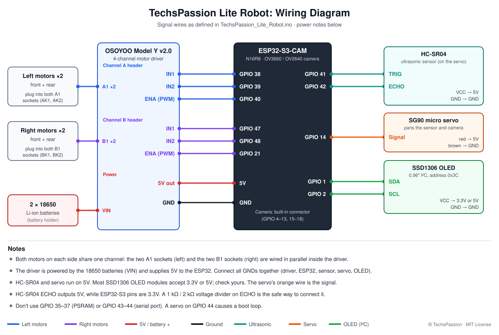

# TechsPassion Lite Robot

A Wi-Fi controlled 4WD tank robot built on an **ESP32-S3 camera board**. It serves its own web app, so you can drive it from any phone or computer browser with a live camera feed. It also has an ultrasonic radar scan and a sensor-based **Auto Pilot** mode that avoids obstacles.

No app to install and no cloud. The robot hosts everything itself.

## Watch the video

[](https://youtu.be/lfj8uh1iPEw)

▶️ **[Meet TechsPassion Lite: The Ultra-Budget ESP32 Robot](https://youtu.be/lfj8uh1iPEw)** on YouTube

## Features

- **Live camera stream** (MJPEG on its own server, so video never slows down driving)
- **Mobile-friendly control panel**: D-pad, 3 speed gears, camera pan slider, full-screen "Drive view" with the controls over the video
- **Keyboard driving** on desktop: arrow keys / WASD, Space to stop
- **Radar Scan**: the servo sweeps the ultrasonic sensor from 30° to 150° and draws a map of what's around the robot
- **Auto Pilot**: drives on its own, slows down near obstacles, sweeps for the most open path and turns toward it. It detects when it's stuck or trapped in a corner and backs out
- **Safety**:
  - Stops automatically if the controller goes quiet for 600 ms (Wi-Fi drop, tab closed, phone locked)
  - Refuses to drive forward when something is closer than 15 cm
- **Wi-Fi fallback hotspot**: if it can't reach your Wi-Fi, the robot creates its own network so you can still drive it
- **OLED status screen**: IP address, distance, mode, speed, camera status
- **Over-the-air (OTA) updates**: flash new code over Wi-Fi once the robot is assembled

## Hardware

| Part | Notes |
|---|---|
| ESP32-S3-WROOM-1 **N16R8** CAM board | 16 MB flash, 8 MB OPI PSRAM, OV3660 (or OV2640) camera |
| OSOYOO Model Y 4-channel motor driver (v2.0) | Also provides the 5 V supply |
| 4WD chassis with 4 DC gear motors | Tank / skid steering |
| HC-SR04 ultrasonic sensor | Mounted on the servo together with the camera |
| Micro servo (SG90 style) | Pans the sensor and camera |
| 0.96" SSD1306 I2C OLED (128×64) | Address `0x3C` |
| 2 × 18650 Li-ion batteries | Power the motor driver, which also supplies the 5 V for the board |
| 3D-printed parts | Printable files on [Thingiverse](https://www.thingiverse.com/thing:7414351) |

### 3D-printed parts

The printable parts for this robot are on Thingiverse:
**[thingiverse.com/thing:7414351](https://www.thingiverse.com/thing:7414351)**

### Wiring



**Motors**: plug both left motors into the two **A1** sockets and both right motors into the two **B1** sockets. The sockets are paralleled inside the driver, so each side only needs one set of control pins.

| Function | ESP32-S3 GPIO |
|---|---|
| Left IN1 (A) | 38 |
| Left IN2 (A) | 39 |
| Left ENA (PWM) | 40 |
| Right IN1 (B) | 47 |
| Right IN2 (B) | 48 |
| Right ENB (PWM) | 21 |
| HC-SR04 TRIG | 41 |
| HC-SR04 ECHO | 42 |
| OLED SDA | 1 |
| OLED SCL | 2 |
| Servo signal | 14 |

The camera uses the board's built-in connector: GPIO 4-13 and 15-18.

> [!WARNING]
> **Pins to avoid on the ESP32-S3:**
> - **GPIO 35, 36, 37** are used by the PSRAM. Touching them crashes the board.
> - **GPIO 44** (the UART RX) causes a boot loop if a servo is connected to it. That's why the servo is on GPIO 14.
> - **GPIO 43** is the serial TX pin.

> [!NOTE]
> The motor driver's 5 V regulator can brown out if the camera, Wi-Fi and servo all start at the same moment. The firmware holds the servo still until everything else has booted. Keep it that way if you modify the code.

## Software setup

### 1. Arduino IDE and the ESP32 core

1. Install the [Arduino IDE](https://www.arduino.cc/en/software) (2.x).
2. Go to **File → Preferences** and add this URL to *Additional boards manager URLs*:
   `https://espressif.github.io/arduino-esp32/package_esp32_index.json`
3. Open **Tools → Board → Boards Manager** and install **esp32 by Espressif Systems**, version **3.x**. It was tested with 3.3.11. Version 2.x won't compile, because the code uses the 3.x `ledcAttach()` API.

### 2. Libraries

In **Tools → Manage Libraries**, install:

- **Adafruit SSD1306**
- **Adafruit GFX Library**
- **Adafruit BusIO** (usually installed automatically with the two above)

The camera, web server, Wi-Fi, mDNS and OTA libraries all come with the ESP32 core.

> Don't install or add `ESP32Servo`. It conflicts with the camera's timer. The servo is driven with the ESP32's built-in LEDC PWM instead.

### 3. Your Wi-Fi details

Open `secrets.h` and fill in your network:

```cpp
#define WIFI_SSID     "YOUR_WIFI_NAME"      // must be a 2.4 GHz network
#define WIFI_PASSWORD "YOUR_WIFI_PASSWORD"
```

Also change `AP_PASSWORD`, the password of the robot's fallback hotspot. It must be at least 8 characters.

> [!CAUTION]
> Once you've put your real password in `secrets.h`, don't commit it or share it. If you fork this repo, run `git update-index --skip-worktree secrets.h` so git ignores your local changes to it.

### 4. Board settings

Under **Tools**, select:

| Setting | Value |
|---|---|
| Board | **ESP32S3 Dev Module** |
| PSRAM | **OPI PSRAM** (required for the camera) |
| Flash Size | 16MB (or leave the default) |
| Partition Scheme | Any scheme with OTA, e.g. the default |
| USB CDC On Boot | Enabled (to see Serial output over USB) |

### 5. Upload

- **First time:** connect the board over USB, choose its COM port and click **Upload**.
- **After that:** the robot shows up as a network port called `techspassion-lite-robot` under **Tools → Port**. Select it and upload over Wi-Fi, no cable needed.

## Using the robot

1. Power it on. The OLED shows "Connecting Wi-Fi" and then the robot's IP address.
2. On a phone or computer on the same network, open that IP, or open **http://techspassion-lite-robot.local**.
3. Drive with the D-pad, pick a speed, pan the camera, or press **Radar Scan** or **Auto Pilot**. Any direction button takes back manual control.

**Tip:** on a phone, tap the full-screen button on the camera for Drive view. On iPhone, use **Share → Add to Home Screen** to get it without the browser bar.

### Hotspot mode

If the robot can't join your Wi-Fi within 15 seconds, or it loses your Wi-Fi for 30 seconds, it starts its own network. The default is `TPRLite`; the password is whatever you set in `secrets.h`. The OLED shows the network name and password.

1. Join that network with your phone.
2. Open **http://192.168.4.1**.

The robot retries your home Wi-Fi every minute while no phone is connected to the hotspot. It switches back by itself, without rebooting.

## Web API

The control page talks to these endpoints on port 80. You can call them from your own scripts too.

| Endpoint | What it does |
|---|---|
| `/` | The control page |
| `/control?cmd=F\|B\|L\|R\|S` | Drive forward / back / left / right / stop. Also cancels Auto Pilot and Radar |
| `/control?cmd=A` | Start Auto Pilot |
| `/control?cmd=RDR` | Start a radar scan |
| `/servo?pos=0..180` | Pan the camera and sensor |
| `/speed?val=0..255` | Motor speed (PWM) |
| `/status` | JSON telemetry: distance, mode, speed, pan, Wi-Fi signal, radar points… |
| `:81/stream` | MJPEG camera stream |

Manual drive commands must be repeated at least every 600 ms, or the robot stops. The control page re-sends them every 200 ms while a button is held.

## Tuning

All tuning values are at the top of the `.ino` file:

- **Distances:** `MANUAL_STOP_CM`, `AUTO_OBSTACLE_CM`, `AUTO_SLOW_CM`
- **Speeds:** `AUTO_MIN_SPEED`, `AUTO_TURN_SPEED`
- **Timing:** `STA_CONNECT_MS`, `CMD_TIMEOUT_MS`

If the radar map or the pan slider looks mirrored on your build, set `PAN_LEFT_IS_HIGH` to `0`.

## Known limitations

Auto Pilot only uses the ultrasonic sensor; the camera isn't used for navigation. That means it can't see:

- drops or stairs
- thin objects like chair legs
- soft things like curtains or fabric

It also has no rear sensor when it reverses. Ideas for upgrades:

- an IMU (MPU6050) for accurate turns
- VL53L0X time-of-flight sensors on the sides
- IR cliff sensors
- a voltage divider for battery monitoring

## Security note

The control page and OTA updates have no password. Anyone on the same network can drive the robot or upload new firmware to it. That's fine on a home network, but don't expose it to the internet. For OTA, you can add `ArduinoOTA.setPassword("...")` before `ArduinoOTA.begin()` in `setup()`.

## Disclaimer

This project is provided **"as is"**, without warranty of any kind, express or implied, including but not limited to fitness for a particular purpose. It is a hobby project shared for educational use.

**You build and use it entirely at your own risk.** TechsPassion is not responsible or liable for any damage, injury, loss or other consequences that result from using the code, the wiring information, the 3D-printed parts or any other part of this project. That includes, for example, damaged components, damaged property, or injury from moving parts.

- **Batteries:** 18650 lithium-ion cells can overheat, catch fire or explode if they're shorted, damaged, over-discharged or charged incorrectly. Use protected cells and a proper charger, and never leave the robot charging or running unattended.
- **Wiring:** double-check every connection before powering on. Wiring mistakes can permanently damage the board and other parts.
- **Camera and wireless:** you're responsible for using the robot in line with the laws where you live, including privacy laws about recording people and rules for wireless devices.

All product names and brands mentioned here belong to their respective owners. This project isn't affiliated with or endorsed by any of them.

## License

Released under the [MIT License](LICENSE). You're free to use, modify and share it, as long as you keep the copyright and license notice. The license's "as is" and no-liability terms apply to the whole project.

---

Made by **TechsPassion**. Build it, remix it and share what you make!
